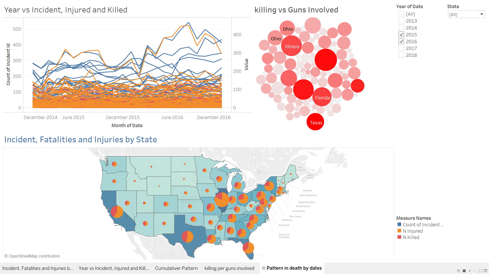

## Tableau Project
This is the visualization project where I tried to find some answer on the gun-violence dataset .

This dataset is taken from kaggle. It consist of 2M+ data from the year **_2013-2018_** for **The United States of America**( although there isn't much data from 2013 ). The **_dataset_** includes features like -

1. Incident id
2. Date
3. State
4. Participant_gender
5. Participant_relationship
6. Number of killings ( N_killed )
7. Number of injuries ( N_injured )
8. Gun_type and so on.

The **_questions_** I am trying to answer is -

1. Start with very simple one, which states are worst affected by the gun violence?
2. What percentage of people get killed and does the number of killing increases with the increase in the incident reported?
3. Is there any particular pattern in year or months or may be days where gun-violence is increasing or decreasing?
4. Can we say that number of guns involved indicates high incident in that county or state?
5. How many percentage of time, the killer involved is the family person or someone related to the victims?
6. Does men attack female more or other-way-round.
7. Is there any common reason I can found in majority of the incidents reported?
and many more...

I have build a **_Tableau Dashboard_** and try to answer as many questions as I can.

You can check my **_presentation_** too if you are too a curious mind. I am still working on this set, hopefully will find a lot of interesting facts and answers using it.

Also, you can explore more about this visualization on my [Tableau](https://public.tableau.com/profile/anshusingh#!/vizhome/TrendinGunViolenceUSA/Patternindeathbydates) page.

Thank you for stopping by!
